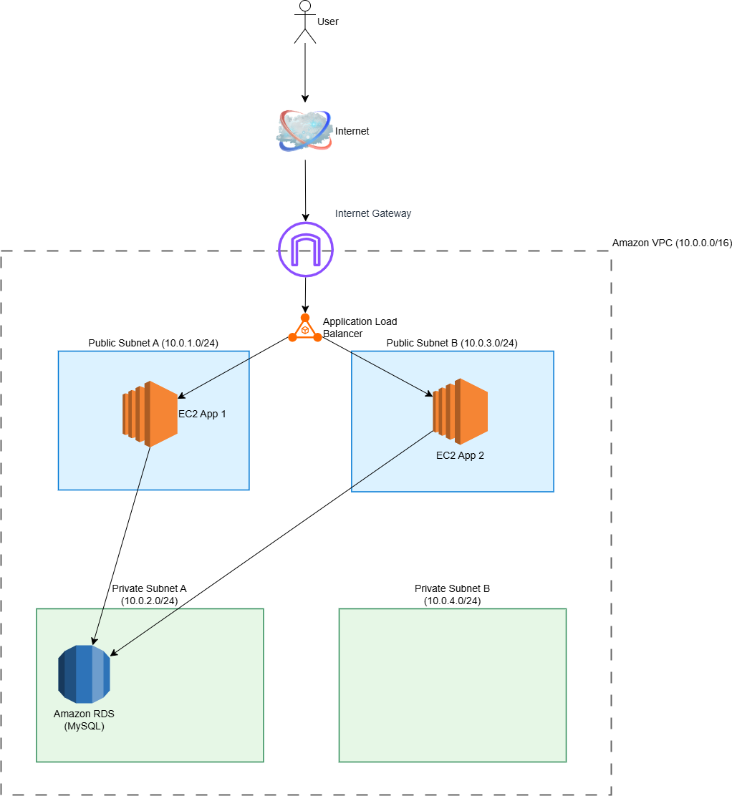
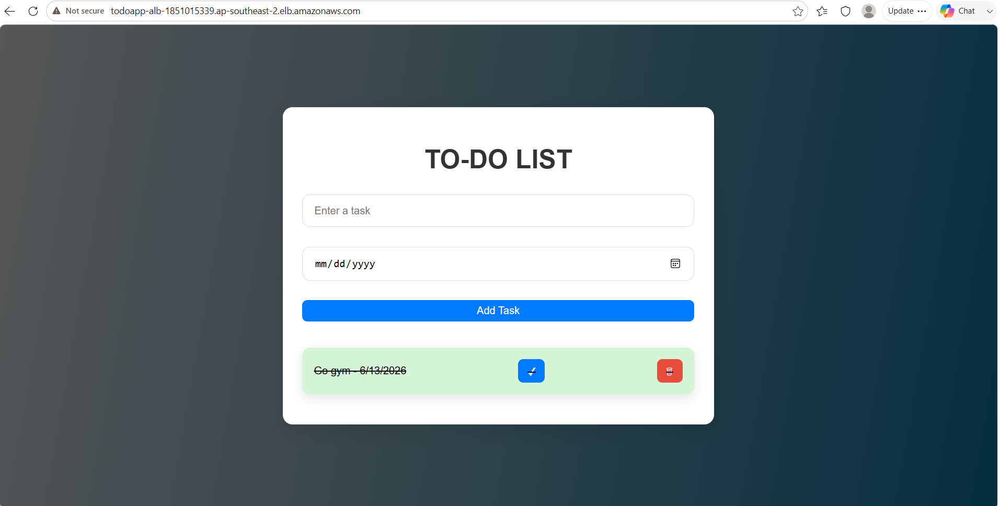
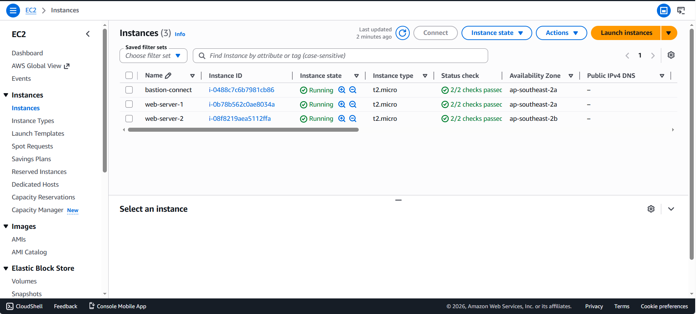
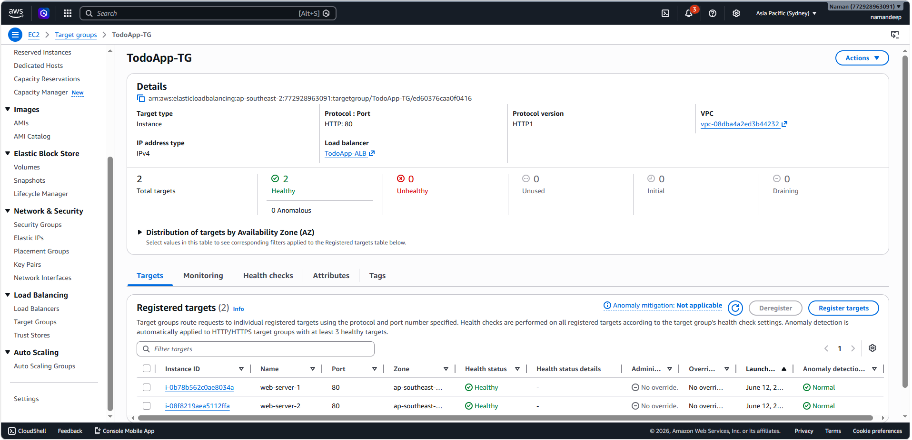
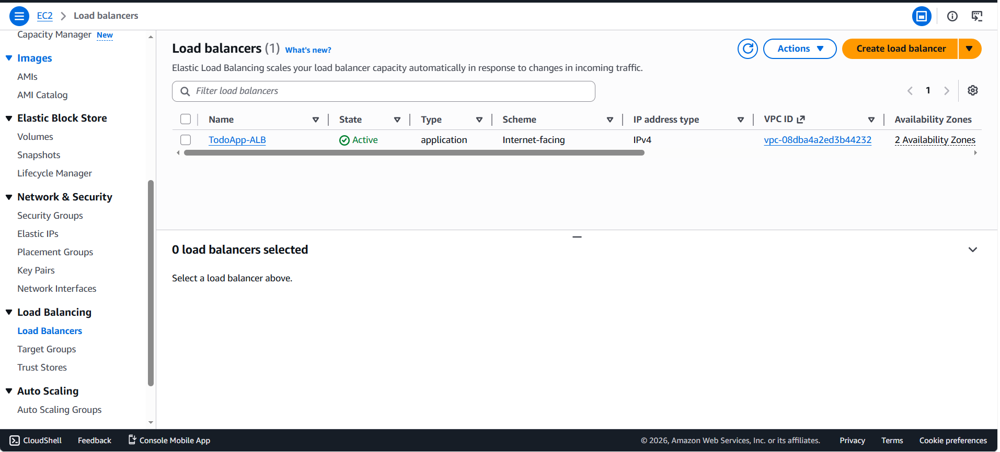
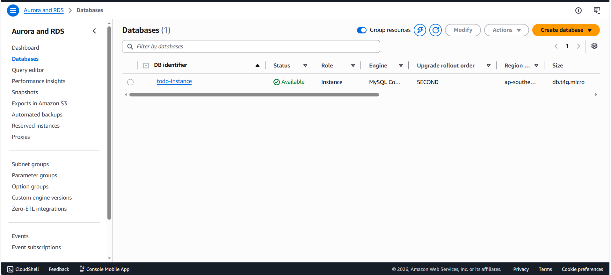
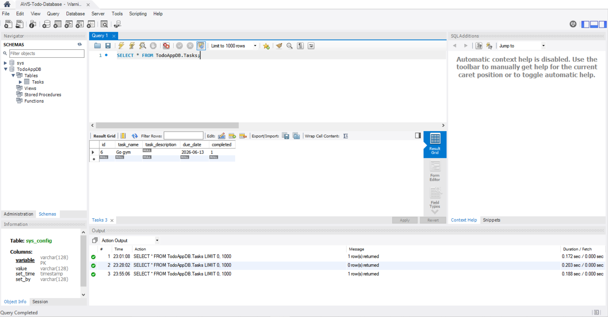

# ✅ Two-Tier To-Do List Application on AWS

## 📋 Overview
A fully functional To-Do List web application deployed using a two-tier architecture on AWS. The architecture separates the application layer and database layer for scalability, security, and high availability.

## 🛠️ AWS Services Used
- **Amazon EC2** - Hosts Node.js application on two instances for redundancy
- **Amazon RDS** - Managed MySQL database for persistent storage
- **Application Load Balancer** - Distributes traffic across EC2 instances
- **Amazon VPC** - Isolated networking with public/private subnets
- **Security Groups** - Controls inbound/outbound traffic
- **IAM** - Manages secure service permissions

## 🏗️ System Architecture

## 📸 Screenshots

### Application Interface

### EC2 Instances (3 total: 2 App + 1 Bastion)

### Target Group (Both Instances Healthy)

### Load Balancer (ALB)

### RDS Database

### MySQL Workbench (Tasks Persisted in Database)

## ✨ Features
- ✅ Create, read, update, and delete to-do items
- ✅ High availability with 2 EC2 instances
- ✅ Load balancing for fault tolerance
- ✅ Persistent data storage with RDS MySQL
- ✅ Secure VPC with database in private subnet
- ✅ Bastion host for secure database access
- ✅ Free Tier eligible
- ✅ Fully tested with MySQL Workbench — tasks persist and are verifiable

## 🔧 How It Works
1. User sends request to the ALB endpoint
2. ALB distributes traffic between two EC2 instances
3. Node.js app processes the request
4. App reads/writes data to RDS MySQL database
5. Response returns to user

## 🔧 Deployment Steps
### Prerequisites
- AWS account (Free Tier eligible)
- IAM user with EC2, RDS, VPC, and ALB permissions

### Step 1: VPC & Networking
- Create VPC with CIDR block `10.0.0.0/16`
- Create 2 public subnets and 2 private subnets
- Create Internet Gateway and attach to VPC
- Configure route tables

### Step 2: Database Layer (RDS)
- Launch MySQL database in private subnets
- Configure security group (allow port 3306 from EC2 only)

### Step 3: Application Layer (EC2 + ALB)
- Launch 2 EC2 instances in public subnets
- Install Node.js and clone application code
- Configure security group (allow HTTP on port 80 from ALB)
- Create Application Load Balancer
- Register both EC2 instances to ALB target group

### Step 4: Connect App to Database
- Configure `.env` file with RDS endpoint, username, and password
- Update `API_BASE_URL` with ALB DNS link
- Resolve entry point conflict (shift from `server.js` to `index.js`)
- Launch server using `node index.js &` in background
- Verify data persistence via MySQL Workbench through SSH tunnel to Bastion Host

## 👨‍💻 Author
**Namandeep Singh** - Computer Science Graduate

[Portfolio](https://naman5911-code.github.io/.github.io/) | [LinkedIn](https://www.linkedin.com/in/namandeep-singh-31b2412a1)
